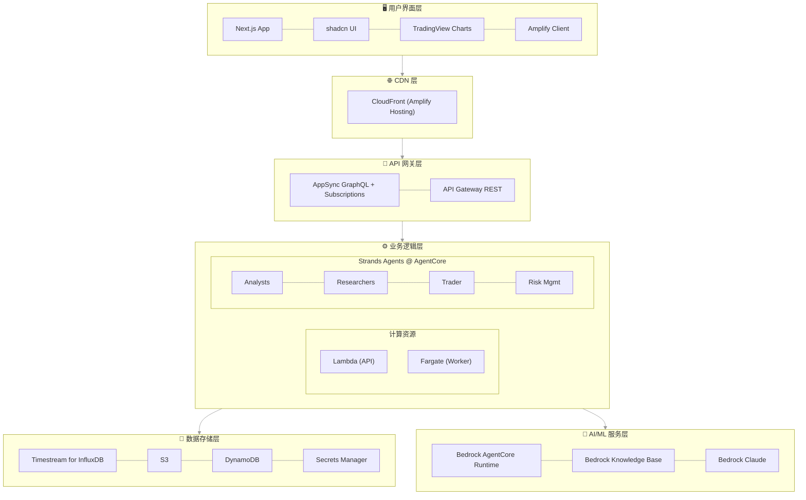
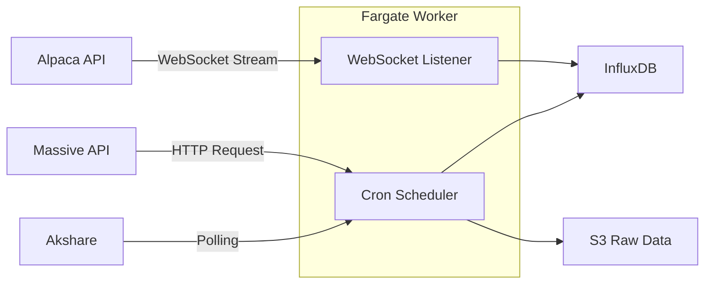
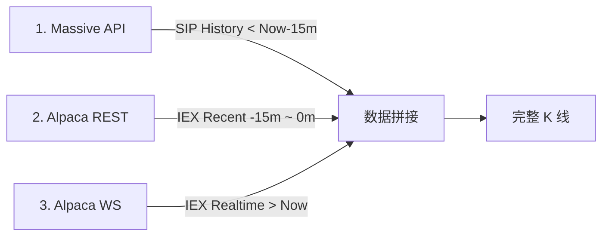
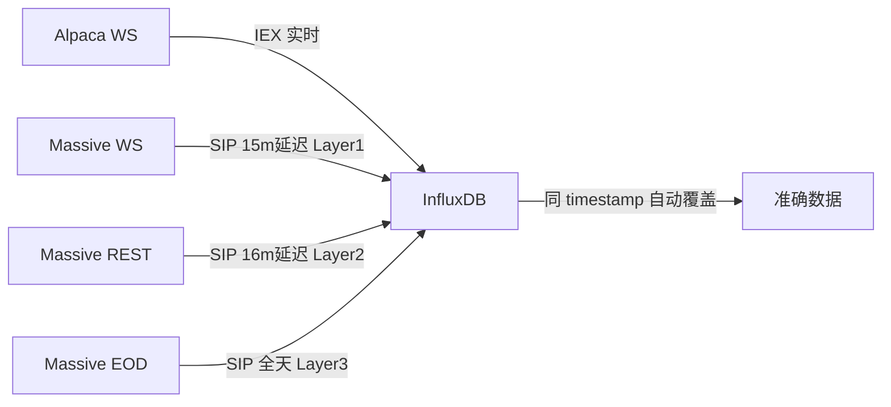
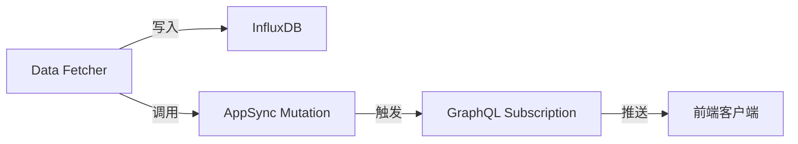
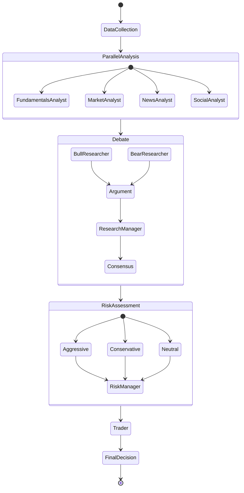
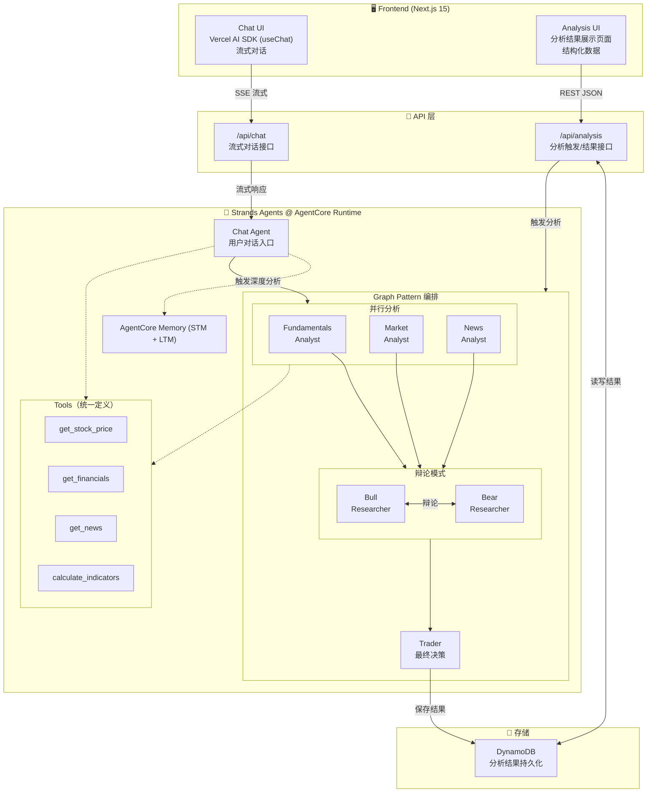

# WavePilotAI 系统设计文档

## 🏗️ 系统架构总览

### 架构原则
- **Serverless 优先**：充分利用 AWS 托管服务，减少运维负担
- **事件驱动**：基于事件触发的异步处理架构
- **统一部署**：使用 Amplify Gen 2 统一管理全栈基础设施
- **All TypeScript**：前端、后端、Agents 全栈使用 TypeScript
- **可观测性**：完整的日志、监控和追踪体系
- **成本优化**：按需计费，自动扩缩容

### 系统架构图



> 📌 所有基础设施通过 Amplify Gen 2 (基于 CDK) 统一管理，包括 AgentCore

## 🚀 Amplify Gen 2 统一架构

### 为什么选择 Amplify Gen 2？

**Amplify Gen 2 = CDK + 前端优化 + 自动 CI/CD**

- ✅ **统一部署**：一个命令部署所有资源（前端 + 后端 + AgentCore）
- ✅ **基于 CDK**：可以使用任何 AWS 服务，不受限制
- ✅ **自动 CI/CD**：Git push 自动触发构建和部署
- ✅ **深度集成**：前后端自动配置，无需手动管理 CORS、环境变量等
- ✅ **开发体验**：本地开发环境自动配置，热重载支持

### 项目结构

```
wavepilot/
├── packages/
│   └── shared/                # 共享类型和工具 (@wavepilot/shared)
│       ├── src/types/         # 共享类型定义
│       └── package.json
│
├── apps/
│   ├── frontend/              # Next.js + Amplify Gen 2 (UI & API)
│   │   ├── amplify/           # AWS 资源定义 (Backend + AgentCore CDK)
│   │   │   ├── backend.ts     # 统一资源定义（含 Worker/AgentCore CDK）
│   │   │   ├── auth/
│   │   │   ├── data/
│   │   │   └── functions/
│   │   ├── app/               # Next.js App Router
│   │   └── package.json
│   │
│   ├── worker/                # TypeScript Fargate Worker (数据摄取)
│   │   ├── Dockerfile
│   │   ├── src/
│   │   │   ├── services/      # InfluxDB Writer, News Service
│   │   │   ├── utils/         # Data transformers
│   │   │   └── index.ts       # Fargate Worker 入口
│   │   └── package.json
│   │
│   └── agents/                # Strands Agents TypeScript
│       ├── Dockerfile         # AgentCore 容器
│       ├── src/
│       │   ├── index.ts       # Express 服务器入口
│       │   ├── orchestrator.ts # 多 Agent 编排
│       │   ├── agents/        # Agent 定义
│       │   └── tools/         # Agent 工具
│       └── package.json
│
├── docs/                      # 项目文档
├── package.json               # npm workspaces 根配置
└── amplify.yml                # CI/CD 构建配置 (手动管理以支持 Monorepo)
```

> **npm workspaces**：项目使用 npm workspaces 管理 monorepo，共享类型通过 `@wavepilot/shared` 包在各 app 间共享。所有 app 通过 Amplify Gen 2 统一部署。

### 资源定义方式

在 `amplify/backend.ts` 中使用 CDK 定义所有资源：

```typescript
import { defineBackend } from '@aws-amplify/backend';
import * as s3 from 'aws-cdk-lib/aws-s3';
import * as cdk from 'aws-cdk-lib';
import * as path from 'path';
import * as agentcore from '@aws-cdk/aws-bedrock-agentcore-alpha';

const backend = defineBackend({
  auth,    // Cognito
  data,    // AppSync + DynamoDB
  dataFetcher,  // Lambda functions
});

// 获取 CDK stack，可以添加任何 AWS 资源
const dataStack = backend.createStack('DataResources');
const agentStack = backend.createStack('AgentResources');

// 注意：InfluxDB 3 实例通过 AWS Console 手动创建
// 环境变量 INFLUXDB_ENDPOINT 和 INFLUXDB_SECRET_ARN 需要配置

// ========================================================================
// AgentCore Runtime - 使用 @aws-cdk/aws-bedrock-agentcore-alpha
// ========================================================================

// 从本地代码构建 Agent 容器镜像
// CDK 会自动构建 Docker 镜像并推送到 ECR
const agentArtifact = agentcore.AgentRuntimeArtifact.fromAsset(
  path.join(__dirname, '../../agents')  // 指向 agents 应用目录
);

// 创建 AgentCore Runtime
const agentRuntime = new agentcore.Runtime(agentStack, 'StockAnalyst', {
  runtimeName: 'wavepilot_stock_analyst',
  agentRuntimeArtifact: agentArtifact,
  description: 'WavePilot AI multi-agent stock analysis runtime',
  // 可选：生命周期配置
  lifecycleConfiguration: {
    idleRuntimeSessionTimeout: cdk.Duration.minutes(15),
    maxLifetime: cdk.Duration.hours(8),
  },
});

// ========================================================================
// AgentCore Memory - 使用 @aws-cdk/aws-bedrock-agentcore-alpha
// ========================================================================

// 创建 Agent Memory（支持 Short-term 和 Long-term Memory）
const agentMemory = new agentcore.Memory(agentStack, 'AgentMemory', {
  memoryName: 'wavepilot_agent_memory',
  description: 'WavePilot AI agent memory for user preferences and analysis history',
  
  // Short-term Memory 过期时间（默认 90 天）
  expirationDuration: cdk.Duration.days(90),
  
  // Long-term Memory 策略配置
  memoryStrategies: [
    // 1. 用户偏好策略：自动学习风险偏好、关注股票等
    agentcore.MemoryStrategy.usingUserPreference({
      name: 'UserPreferenceLearner',
      namespaces: ['/wavepilot/preferences/{actorId}'],
    }),
    
    // 2. 摘要策略：自动生成会话摘要
    agentcore.MemoryStrategy.usingSummarization({
      name: 'SessionSummarizer',
      namespaces: ['/wavepilot/summaries/{actorId}/{sessionId}'],
    }),
    
    // 3. 语义记忆策略：提取事实信息（如分析结论）
    agentcore.MemoryStrategy.usingSemantic({
      name: 'AnalysisFactExtractor',
      namespaces: ['/wavepilot/facts/{actorId}'],
    }),
  ],
});
```

> **注意**：`@aws-cdk/aws-bedrock-agentcore-alpha` 目前处于 Experimental 阶段，API 可能变化。请关注 [GitHub 仓库](https://github.com/aws/aws-cdk/tree/main/packages/@aws-cdk/aws-bedrock-agentcore-alpha) 获取最新更新。

## 📊 数据流设计

### 1. 数据获取流程 (Hybrid)



### 2. 数据获取与存储策略 (混合源成本优化策略)

> **背景**: Massive $29/mo 套餐有 15分钟延迟。为了实现实时无缝体验且不增加成本，我们采用 **Massive (历史 SIP) + Alpaca (实时 IEX)** 混合拼接方案。

#### 核心方案：三段式数据拼接 (Three-Stage Stitching)

为了填补 Massive 的 15 分钟延迟空缺，我们将数据流分为三段拼接：



#### A. 自选股 (Watchlist) - "三层 SIP 数据修正"

**数据流架构**：


**三层 SIP 数据修正策略**：

| 层级 | 数据源 | 触发方式 | 延迟 | 说明 |
|------|--------|----------|------|------|
| Layer 1 | Massive WebSocket | 实时推送 | 15 分钟 | 如果连接数允许，实时接收 AM 数据 |
| Layer 2 | Massive REST API | 每分钟轮询 | 16 分钟 | 稳定可靠，不受连接数限制 |
| Layer 3 | Massive Aggregates | 收盘后 4:30 PM | 全天 | 兜底保障，确保数据完整 |

*   **添加时 (Auto-Backfill)**: Fargate 执行 **三段式补全**：
    1.  **远端历史 (Stage 1)**: 调用 Massive `Aggregates` 获取 `1 Month Ago` ~ `Now - 15m` (SIP 数据，延迟但准确)。
    2.  **近端补缺 (Stage 2)**: 调用 Alpaca `Bars` API 获取 `Now - 15m` ~ `Now` (IEX 数据，实时填补空缺)。
    3.  **写入**: 将拼接后的数据写入 `stock_quotes_raw`。
*   **实时 (Stage 3)**: 监听 Alpaca WebSocket (IEX)，实时写入 `stock_quotes_raw`。
*   **滚动修正 (Layer 1)**: 监听 Massive WebSocket (SIP)，15 分钟后自动覆盖 IEX 数据。
    *   Massive WS 保持连接至收盘后 15 分钟，确保当天所有数据都被 SIP 修正。
    *   ⚠️ 受 Polygon.io 账户连接数限制，可能不可用。
*   **轮询修正 (Layer 2)**: 每分钟调用 Massive REST API 获取 16 分钟前的 SIP 数据。
    *   稳定可靠，不受 WebSocket 连接数限制。
    *   API 调用量可控（每分钟 N 个 ticker）。
*   **EOD 修正 (Layer 3)**: 收盘后调用 Massive API 修正全天数据（兜底）。

#### B. 非自选股 - "日线快照 + 实时透传"
*   **全市场日线快照**: Fargate 每 5 分钟调用 Massive `Snapshot` API，写入 `stock_quotes_aggregated` 日线表。
    *   数据特点：15 分钟延迟的当日汇总数据（day OHLCV）
    *   用途：热力图、涨幅榜等**非实时敏感**的宏观分析
    *   **EOD 自动覆盖**: 收盘后 `Grouped Daily` API 返回官方 SIP 数据，自动覆盖 Snapshot 的延迟数据（InfluxDB 同 timestamp + tags 自动覆盖）
*   **详情页查看 (On-Demand)**:
    *   **历史**: 透传 Massive API (SIP, < -15m)。
    *   **近端**: 透传 Alpaca API (IEX, > -15m) 以获取最新走势。

#### C. 数据拼接逻辑 (Data Stitching)
为了实现无缝图表体验，API 层按以下逻辑返回数据：

1.  **分时/分钟图 (Intraday)**:
    *   `History` (< 今日 09:30): 读 `stock_quotes_raw` (自选) 或 透传 Massive API (非自选)。
    *   `Today` (09:30 ~ Now): 读 `stock_quotes_raw` + (非自选时) 实时 API 补全空隙。
2.  **日线/周线图 (Daily/Weekly)**:
    *   `History` (< 今日): 直接读 `stock_quotes_aggregated` (全市场日线已存)。
    *   `Today` (实时): 取 `stock_quotes_raw` 中最新一条数据拼接到最后。

### 2. 实时数据推送流程（AppSync Subscription）



**AppSync 优势**：
- **自动连接管理**：无需手动处理 WebSocket 连接
- **内置扩展性**：自动扩展，无连接数限制
- **离线支持**：客户端离线后自动缓存，上线后同步
- **简化开发**：无需管理连接状态

### 3. 技术指标计算策略 (On-Demand)

> **核心原则**：技术指标（MA, MACD, RSI 等）属于衍生数据，采用**按需即时计算**策略，**不进行持久化存储**。这能最大程度降低存储成本并提高分析灵活性。

#### 计算分层架构

| 场景 | 计算位置 | 负责组件 | 数据源 | 优势 |
| :--- | :--- | :--- | :--- | :--- |
| **前端图表展示** | 浏览器端 (Client) | `TradingView Lightweight Charts` | API 返回的 K 线数据 | 响应微秒级，通过 GPU 加速渲染，后端零压力 |
| **Agent 深度分析** | 内存中 (In-Memory) | `MarketAnalyst` Agent | 从 Timestream 读取的 Recent K 线 | 灵活计算任意参数（如 EMA-13 vs EMA-20），无 I/O 瓶颈 |

#### 工作流程示例 (Agent 分析)

1. **获取数据**：`MarketAnalyst` 请求最近 500 根 K 线 (`stock_quotes_raw`)。
2. **内存计算**：
   - 使用 `talib` 或 `technicalindicators` 库。
   - 动态计算所需指标（如 `calculateRSI(closePrices, 14)`）。
3. **执行分析**：基于计算结果判断趋势（如 "RSI > 80, 超买"）。
4. **释放内存**：分析报告生成后，指标数据随内存回收，**不写入数据库**。

#### 缠论特征计算（第三阶段）

> **说明**：缠论（Chanlun）是一种基于 K 线形态的技术分析方法，计划在第三阶段实现。

| 特征 | 描述 | 计算复杂度 |
| :--- | :--- | :--- |
| K 线包含关系 | 处理相邻 K 线的包含关系，生成标准化 K 线 | O(n) |
| 分型识别 | 识别顶分型和底分型 | O(n) |
| 笔识别 | 连接分型形成笔 | O(n) |
| 中枢计算 | 识别价格中枢区间 | O(n²) |
| 背驰因子 | 基于 MACD 面积计算背驰强度 | O(n) |

实现方式：同样采用 On-Demand 计算策略，在 `MarketAnalyst` Agent 中按需计算。

### 4. Agent 分析流程



### Agent 角色说明

| 角色 | 职责 |
|------|------|
| **分析师团队** | 并行执行，各自专注一个领域 |
| FundamentalsAnalyst | 财务报表分析、估值计算（PE/PB/DCF） |
| MarketAnalyst | 技术指标、趋势识别、支撑阻力位 |
| NewsAnalyst | 新闻事件影响评估、宏观分析 |
| SocialAnalyst | 社交媒体情绪、市场热点 |
| **研究团队** | 顺序辩论，形成共识 |
| BullResearcher | 乐观视角，识别增长机会 |
| BearResearcher | 悲观视角，识别风险因素 |
| ResearchManager | 协调辩论、综合双方观点、形成研究共识 |
| **风险团队** | 多角度评估 |
| Aggressive/Conservative/Neutral | 三种风险偏好下的策略评估 |
| RiskManager | 综合风险评估、制定风险限额 |
| **执行** | 最终决策 |
| Trader | 综合所有分析，输出买入/持有/卖出建议、目标价位、置信度 |

## 🗄️ 数据库设计

### 1. Amazon Timestream for InfluxDB 数据模型

> **说明**：项目使用 Amazon Timestream for InfluxDB（托管 InfluxDB 3 服务）。InfluxDB 采用 **Schema-on-Write** 模式，无需显式创建表，数据通过 Line Protocol 写入时自动创建 Measurement（类似表）。
>
> **数据组织**：
> - **Measurement**：类似关系数据库的表
> - **Tags**：索引字段，用于快速过滤（如 ticker, market）
> - **Fields**：数据字段，存储实际值（如 price, volume）
> - **Timestamp**：时间戳，InfluxDB 的核心维度
>
> **数据保留**：通过 InfluxDB Bucket 的 Retention Policy 配置，而非 SQL 语法。

#### stock_quotes_raw（原始行情数据 - 1 分钟）

> **数据源**：Massive Aggregates API (minute)、Alpaca Bars API
> **用途**：存储分钟级 K 线数据，支持分时图、5分钟/30分钟/1小时等周期聚合
> **保留策略**：7 天热数据 + 10 年冷存储

| 字段类型 | 字段名 | 数据类型 | 说明 | API 映射 |
|---------|--------|---------|------|----------|
| **Tag** | ticker | String | 股票代码（AAPL, 000001.SZ） | - |
| **Tag** | market | String | 市场（US, CN, HK） | - |
| **Field** | name | String | 股票名称 | - |
| **Field** | open | Float | 开盘价 | Massive: `o`, Alpaca: `OpenPrice` |
| **Field** | high | Float | 最高价 | Massive: `h`, Alpaca: `HighPrice` |
| **Field** | low | Float | 最低价 | Massive: `l`, Alpaca: `LowPrice` |
| **Field** | close | Float | 收盘价 | Massive: `c`, Alpaca: `ClosePrice` |
| **Field** | volume | Integer | 成交量 | Massive: `v`, Alpaca: `Volume` |
| **Field** | vwap | Float | 成交量加权均价 | Massive: `vw`, Alpaca: `VWAP` |
| **Field** | trades | Integer | 成交笔数 | Massive: `n`, Alpaca: `TradeCount` |
| **Field** | change | Float | 涨跌额（可选） | 衍生计算 |
| **Field** | changePercent | Float | 涨跌幅%（可选） | 衍生计算 |
| **Field** | previousClose | Float | 前收盘价（可选） | - |

#### stock_quotes_aggregated（聚合行情数据 - 日线）

> **数据源**：Massive Aggregates API (day)、Massive Grouped Daily API
> **用途**：仅存储每日 (1D) 的历史 K 线数据
> **保留策略**：28 天热数据 + 10 年冷存储
>
> **设计原因**：
> 1. **查询加速**：日线及以上周期（周/月）图表跨度通常为数年，直接查询 1D 数据远快于从 1m Raw 数据聚合
> 2. **分工明确**：分时/5分钟/30分钟/1小时等分钟级周期由 `stock_quotes_raw` (1m) 实时聚合；日/周/月/年线由本表支持
> 3. **数据一致性**：每日收盘后使用 Massive `Grouped Daily` 官方数据校准，确保历史日线准确无误

| 字段类型 | 字段名 | 数据类型 | 说明 | API 映射 |
|---------|--------|---------|------|----------|
| **Tag** | ticker | String | 股票代码 | Grouped: `T` |
| **Tag** | market | String | 市场（US, CN, HK） | - |
| **Field** | name | String | 股票名称 | - |
| **Field** | open | Float | 开盘价 | `o` |
| **Field** | high | Float | 最高价 | `h` |
| **Field** | low | Float | 最低价 | `l` |
| **Field** | close | Float | 收盘价 | `c` |
| **Field** | volume | Integer | 成交量 | `v` |
| **Field** | vwap | Float | 成交量加权均价 | `vw` |
| **Field** | trades | Integer | 成交笔数 | `n` |
| **Field** | change | Float | 涨跌额 | 衍生: `close - open` |
| **Field** | changePercent | Float | 涨跌幅% | 衍生: `(close-open)/open*100` |

#### fundamentals（基本面数据）

> **数据源**：Massive Financials API (`/vX/reference/financials`)
> **用途**：存储完整财务报表数据，支持按财报周期（季度/年度）查询和历史对比分析
> **保留策略**：90 天热数据 + 10 年冷存储

| 字段类型 | 字段名 | 数据类型 | 说明 | API 映射 |
|---------|--------|---------|------|----------|
| **Tag** | ticker | String | 股票代码 | `tickers[0]` |
| **Tag** | market | String | 市场 | - |
| **Tag** | periodType | String | 'quarterly' \| 'annual' | `timeframe` |
| **Field** | fiscalYear | Integer | 财年 | `fiscal_year` |
| **Field** | fiscalPeriod | String | Q1/Q2/Q3/Q4/FY | `fiscal_period` |
| **Field** | filingDate | String | SEC 申报日期 | `filing_date` |
| **Field** | companyName | String | 公司名称 | `company_name` |
| **Field** | cik | String | SEC CIK 编号 | `cik` |
| **Field** | sic | String | SIC 行业代码 | `sic` |

**利润表 (Income Statement)**

| 字段名 | 说明 | API 映射 |
|--------|------|----------|
| revenue | 营业收入 | `income_statement.revenues` |
| costOfRevenue | 营业成本 | `income_statement.cost_of_revenue` |
| grossProfit | 毛利润 | `income_statement.gross_profit` |
| operatingExpenses | 营业费用 | `income_statement.operating_expenses` |
| operatingIncome | 营业利润 | `income_statement.operating_income_loss` |
| netIncome | 净利润 | `income_statement.net_income_loss` |
| eps | 基本每股收益 | `income_statement.basic_earnings_per_share` |
| epsDiluted | 稀释每股收益 | `income_statement.diluted_earnings_per_share` |
| sharesBasic | 基本股数 | `income_statement.basic_average_shares` |
| sharesDiluted | 稀释股数 | `income_statement.diluted_average_shares` |

**资产负债表 (Balance Sheet)**

| 字段名 | 说明 | API 映射 |
|--------|------|----------|
| totalAssets | 总资产 | `balance_sheet.assets` |
| currentAssets | 流动资产 | `balance_sheet.current_assets` |
| totalLiabilities | 总负债 | `balance_sheet.liabilities` |
| currentLiabilities | 流动负债 | `balance_sheet.current_liabilities` |
| totalEquity | 股东权益 | `balance_sheet.equity` |
| fixedAssets | 固定资产 | `balance_sheet.fixed_assets` |
| accountsPayable | 应付账款 | `balance_sheet.accounts_payable` |

**现金流量表 (Cash Flow Statement)**

| 字段名 | 说明 | API 映射 |
|--------|------|----------|
| operatingCashFlow | 经营活动现金流 | `cash_flow_statement.net_cash_flow_from_operating_activities` |
| investingCashFlow | 投资活动现金流 | `cash_flow_statement.net_cash_flow_from_investing_activities` |
| financingCashFlow | 筹资活动现金流 | `cash_flow_statement.net_cash_flow_from_financing_activities` |
| netCashFlow | 净现金流 | `cash_flow_statement.net_cash_flow` |

**估值指标（衍生或外部提供）**

| 字段名 | 说明 |
|--------|------|
| pe | 市盈率 |
| pb | 市净率 |
| marketCap | 市值 |
| roe | 净资产收益率 |

#### news（新闻事件 - 元数据）

> **数据源**：Massive News API
> **用途**：存储新闻元数据，支持情感分析和关联股票查询
> **保留策略**：7 天热数据 + 1 年冷存储
>
> **存储策略**：
> - **InfluxDB**：存储元数据，用于时序查询（按时间、股票、情感筛选）
> - **S3**：存储完整文章内容（抓取的网页），供 Agent 深度分析
> - **S3 Object Metadata**：存储关键属性，无需下载即可快速访问

| 字段类型 | 字段名 | 数据类型 | 说明 | API 映射 |
|---------|--------|---------|------|----------|
| **Tag** | ticker | String | 主要关联股票 | `tickers[0]` |
| **Tag** | market | String | 市场 | - |
| **Tag** | source | String | 新闻来源 | `publisher.name` |
| **Field** | id | String | 新闻唯一 ID | `id` |
| **Field** | title | String | 标题 | `title` |
| **Field** | url | String | 原文链接 | `article_url` |
| **Field** | author | String | 作者 | `author` |
| **Field** | description | String | 摘要描述 | `description` |
| **Field** | imageUrl | String | 配图 URL | `image_url` |
| **Field** | keywords | String | 关键词 (JSON) | `keywords[]` |
| **Field** | tickers | String | 关联股票 (JSON) | `tickers[]` |
| **Field** | sentiment | String | 情感分类 | `insights[].sentiment` |
| **Field** | sentimentScore | Float | 情感评分 (-1~1) | 衍生计算 |
| **Field** | sentimentReasoning | String | 情感分析理由 | `insights[].sentiment_reasoning` |
| **Field** | s3Path | String | S3 完整内容路径 | - |

**S3 存储结构**：
```
s3://wavepilot-data-{account}/raw/news/{ticker}/{date}/{news_id}.json
```

**S3 Object Metadata**：
| Key | 说明 |
|-----|------|
| news-id | 新闻唯一 ID |
| ticker | 主要股票代码 |
| source | 新闻来源 |
| published-at | 发布时间 (ISO) |
| sentiment | 情感分类 |
| has-content | 是否包含抓取内容 |

#### Watchlist（自选股 - Amplify Data Model）

通过 GraphQL Schema 定义，自动创建 DynamoDB 表：

```graphql
type Watchlist @model {
  userId: ID!
  ticker: String!
  name: String!
  market: String
  addedAt: AWSDateTime
  notes: String
  alerts: AWSJSON
}
```

#### simulation_trades（模拟交易）

```json
{
    "userId": "string",          // 分区键
    "tradeId": "string",        // 排序键
    "ticker": "string",
    "name": "string",            // 股票名称
    "market": "string",
    "action": "buy|sell",
    "quantity": "number",
    "price": "number",
    "timestamp": "timestamp",
    "portfolio": "string"
}
```

#### agent_analysis（分析结果）

```json
{
    "analysisId": "string",     // 分区键
    "timestamp": "timestamp",    // 排序键
    "ticker": "string",
    "name": "string",            // 股票名称
    "market": "string",
    "agentType": "string",
    "report": "string",
    "confidence": "number",
    "recommendation": "object"
}
```

### 3. S3 存储结构

单一 S3 存储桶，通过文件夹组织不同类型的数据：

```
s3://wavepilot-data-{account}/
├── raw/                        # 原始数据
│   ├── news/                   # 新闻完整正文 (JSON)
│   │   └── {symbol}/{date}/{id}.json
│   └── financials/             # 完整财报 (XBRL/PDF)
│
├── processed/                   # 处理后数据
│   └── knowledge-base/         # Bedrock Knowledge Base 数据源
```

**生命周期策略**
开发前期不添加 s3 生命周期策略，未来可添加如下策略：
- `raw/`: 90 天后转 IA，365 天后转 Glacier
- `knowledge-base/`: 180 天后转 IA，730 天后转 Deep Archive（永久保留）

## 🤖 Multi-Agent 系统设计

### 1. Agent SDK 选型决策

经过深度对比三种 Agent SDK，选择 **Strands Agents 统一后端 + Vercel AI SDK 前端渲染** 的混合架构：

| SDK | 多 Agent 编排 | 托管部署 | Memory 管理 | AWS 集成 | 前端集成 | 选择 |
|-----|-------------|---------|------------|---------|---------|------|
| **Claude SDK** | ❌ 需自建 | ❌ 无 | ❌ 需自建 | ⚠️ 弱 | ⚠️ 一般 | ❌ 不采用 |
| **Vercel AI SDK** | ❌ 不支持 | ❌ 无 | ❌ 需自建 | ⚠️ 一般 | ✅ 最佳 | ✅ 仅前端 UI |
| **Strands Agents** | ✅ Graph Pattern | ✅ AgentCore | ✅ AgentCore Memory | ✅ 原生 | ⚠️ 需封装 | ✅ 后端核心 |

**架构决策**：
- **后端 Agent 系统**：Strands Agents SDK（所有 AI 逻辑 + Tools）
- **前端对话 UI**：Vercel AI SDK（仅 `useChat` hook 做流式渲染，不定义 tools）
- **Tools 统一**：所有工具在 Strands Agents 中定义一次，用户对话和深度分析共享

### 2. 系统架构



**两种调用模式**：

| 模式 | 入口 | 响应格式 | 适用场景 |
|------|------|---------|---------|
| **对话模式** | `/api/chat` → Chat Agent | SSE 流式文本 | 用户自然语言交互、简单查询 |
| **分析模式** | `/api/analysis` → Orchestrator | JSON 结构化数据 | 深度分析、结果展示页面、历史记录 |

### 3. Strands Agents TypeScript 实现

使用 Strands Agents TypeScript SDK 的 **Graph Pattern** 实现复杂的分析流程：

```typescript
// apps/agents/src/agents/fundamentals-analyst.ts
import { z } from 'zod';
import * as strands from '@strands-agents/sdk';

// 定义工具
const getFinancialsTool = strands.tool({
  name: 'get_financials',
  description: 'Get financial data for a stock',
  inputSchema: z.object({
    ticker: z.string(),
    market: z.enum(['US', 'CN', 'HK']),
  }),
  callback: async (input) => {
    // 调用 Timestream 或外部 API
    return await fetchFinancials(input.ticker, input.market);
  },
});

// 配置 Agent
export const fundamentalsAnalyst = new strands.Agent({
  model: new strands.BedrockModel({
    region: 'us-west-2',
    modelId: 'anthropic.claude-sonnet-4-5-20241022-v2:0',
  }),
  tools: [getFinancialsTool, calculateRatiosTool],
  systemPrompt: `You are a fundamentals analyst...`,
});
```

### 4. Chat Agent（用户对话入口）

用户对话通过 Strands Agent 处理，共享同一套 tools：

```typescript
// apps/agents/src/agents/chat-agent.ts
import { z } from 'zod';
import * as strands from '@strands-agents/sdk';

export const chatAgent = new strands.Agent({
  model: new strands.BedrockModel({
    region: 'us-west-2',
    modelId: 'anthropic.claude-sonnet-4-5-20241022-v2:0',
  }),
  tools: [
    getStockPriceTool,      // 查询股价
    getFinancialsTool,      // 查询财务数据
    getNewsTool,            // 查询新闻
    triggerAnalysisTool,    // 触发深度分析（调用 orchestrator）
  ],
  systemPrompt: `You are WavePilot AI assistant. Help users query stock data and trigger analysis.
  
  You can:
  - Query real-time and historical stock prices
  - Retrieve financial data and fundamentals
  - Fetch related news
  - Trigger deep analysis using multiple specialized agents
  
  Always respond in Chinese. Use tools to get accurate data.`,
});
```

### 5. 前端调用方式

#### 5.1 对话模式（流式）

前端使用 Vercel AI SDK 做流式渲染：

```typescript
// apps/frontend/app/api/chat/route.ts
import { BedrockAgentCoreClient, InvokeAgentCommand } from '@aws-sdk/client-bedrock-agentcore';

export async function POST(req: Request) {
  const { messages, sessionId } = await req.json();
  
  // 调用 AgentCore Runtime，返回流式响应
  const client = new BedrockAgentCoreClient({ region: 'us-west-2' });
  const response = await client.send(new InvokeAgentCommand({
    runtimeName: 'wavepilot_chat_agent',
    prompt: messages[messages.length - 1].content,
    sessionId,
  }));
  
  return new Response(response.body, {
    headers: { 'Content-Type': 'text/event-stream' },
  });
}

// apps/frontend/app/chat/page.tsx
'use client';
import { useChat } from 'ai/react';

export default function ChatPage() {
  const { messages, input, handleInputChange, handleSubmit } = useChat({
    api: '/api/chat',
  });
  
  return (
    <div>
      {messages.map(m => (
        <div key={m.id}>{m.role}: {m.content}</div>
      ))}
      <form onSubmit={handleSubmit}>
        <input value={input} onChange={handleInputChange} />
      </form>
    </div>
  );
}
```

#### 5.2 分析模式（结构化 API）

深度分析通过 REST API 触发，返回结构化 JSON：

```typescript
// apps/frontend/app/api/analysis/route.ts
import { BedrockAgentCoreClient, InvokeAgentCommand } from '@aws-sdk/client-bedrock-agentcore';
import { DynamoDBClient, PutItemCommand, GetItemCommand } from '@aws-sdk/client-dynamodb';

// POST: 触发分析
export async function POST(req: Request) {
  const { ticker, depth } = await req.json(); // depth: 'quick' | 'standard' | 'deep'
  
  const analysisId = `${ticker}-${Date.now()}`;
  
  // 调用 Orchestrator 执行多 Agent 分析
  const client = new BedrockAgentCoreClient({ region: 'us-west-2' });
  const response = await client.send(new InvokeAgentCommand({
    runtimeName: 'wavepilot_orchestrator',
    prompt: JSON.stringify({ ticker, depth, analysisId }),
  }));
  
  // 解析结构化结果
  const result = JSON.parse(await streamToString(response.body));
  
  // 持久化到 DynamoDB
  const dynamodb = new DynamoDBClient({ region: 'us-west-2' });
  await dynamodb.send(new PutItemCommand({
    TableName: 'agent_analysis',
    Item: { analysisId: { S: analysisId }, ...result },
  }));
  
  return Response.json({ analysisId, ...result });
}

// GET: 获取历史分析结果
export async function GET(req: Request) {
  const { searchParams } = new URL(req.url);
  const analysisId = searchParams.get('id');
  
  const dynamodb = new DynamoDBClient({ region: 'us-west-2' });
  const result = await dynamodb.send(new GetItemCommand({
    TableName: 'agent_analysis',
    Key: { analysisId: { S: analysisId! } },
  }));
  
  return Response.json(result.Item);
}
```

```typescript
// 前端调用示例
// apps/frontend/app/stock/[ticker]/analysis/page.tsx
'use client';

export default function AnalysisPage({ params }: { params: { ticker: string } }) {
  const [result, setResult] = useState(null);
  const [loading, setLoading] = useState(false);
  
  const triggerAnalysis = async (depth: 'quick' | 'standard' | 'deep') => {
    setLoading(true);
    const res = await fetch('/api/analysis', {
      method: 'POST',
      body: JSON.stringify({ ticker: params.ticker, depth }),
    });
    setResult(await res.json());
    setLoading(false);
  };
  
  return (
    <div>
      <button onClick={() => triggerAnalysis('quick')}>快速分析</button>
      <button onClick={() => triggerAnalysis('standard')}>标准分析</button>
      <button onClick={() => triggerAnalysis('deep')}>深度分析</button>
      
      {loading && <p>分析中...</p>}
      {result && <AnalysisResultCard data={result} />}
    </div>
  );
}
```

### 6. Agent 服务入口 (Express)

```typescript
// apps/agents/src/index.ts
import express from 'express';
import { fundamentalsAnalyst } from './agents/fundamentals-analyst';
import { marketAnalyst } from './agents/market-analyst';

const PORT = process.env.PORT || 8080;
const app = express();

// AgentCore 健康检查 (必需)
app.get('/ping', (_, res) => res.json({ 
  status: 'Healthy',
  time_of_last_update: Math.floor(Date.now() / 1000),
}));

// Agent 调用 (必需)
app.post('/invocations', express.raw({ type: '*/*' }), async (req, res) => {
  const payload = JSON.parse(new TextDecoder().decode(req.body));
  const { agentType, prompt } = payload;
  
  const agent = agentType === 'fundamentals' 
    ? fundamentalsAnalyst 
    : marketAnalyst;
    
  const response = await agent.invoke(prompt);
  return res.json({ response });
});

app.listen(PORT, () => {
  console.log(`AgentCore Runtime server on port ${PORT}`);
});
```

### 7. Agent 部署（使用 CDK 集成到 Amplify）

在 `apps/frontend/amplify/backend.ts` 中添加 AgentCore 资源：

```typescript
import * as agentcore from '@aws-cdk/aws-bedrock-agentcore-alpha';
import * as path from 'path';

const agentStack = backend.createStack('AgentResources');

// 方式 1：从本地 Dockerfile 构建（推荐）
// CDK 会自动构建 Docker 镜像并推送到 ECR
const agentArtifact = agentcore.AgentRuntimeArtifact.fromAsset(
  path.join(__dirname, '../../agents')  // 指向 Dockerfile 所在目录
);

// 方式 2：从已有 ECR 仓库引用
// const repository = ecr.Repository.fromRepositoryName(agentStack, 'AgentRepo', 'wavepilot-agents');
// const agentArtifact = agentcore.AgentRuntimeArtifact.fromEcrRepository(repository, 'v1.0.0');

// 创建 AgentCore Runtime
const stockAnalystRuntime = new agentcore.Runtime(agentStack, 'StockAnalyst', {
  runtimeName: 'wavepilot_stock_analyst',
  agentRuntimeArtifact: agentArtifact,
  description: 'WavePilot AI multi-agent stock analysis runtime',
});

// 授予 Runtime 调用 Bedrock 模型的权限
// 需要安装 @aws-cdk/aws-bedrock-alpha
// const model = bedrock.BedrockFoundationModel.ANTHROPIC_CLAUDE_SONNET_4_5_V1_0;
// model.grantInvoke(stockAnalystRuntime);

// 创建自定义 Endpoint（可选，用于版本管理）
const prodEndpoint = stockAnalystRuntime.addEndpoint('production', {
  version: '1',
  description: 'Production endpoint - pinned to stable version',
});
```

> **部署方式选择**：
> 1. **CDK 集成**（推荐）：如上所示，通过 Amplify backend.ts 统一管理
> 2. **AgentCore Starter Toolkit**：使用 `bedrock-agentcore` CLI 独立部署
> 3. **手动部署**：通过 AWS Console 创建 AgentCore Runtime

## 🚀 部署架构

### CI/CD 流程 (amplify.yml)

> **说明**：Monorepo 结构下需要在根目录创建 `amplify.yml`，使用 `applications` 配置多应用构建路径。

```yaml
# amplify.yml (项目根目录)
version: 1
applications:
  - appRoot: apps/frontend
    backend:
      phases:
        build:
          commands:
            - npm ci --prefix ../..  # 安装根目录依赖
            - npm ci                  # 安装 frontend 依赖
            - npx ampx pipeline-deploy --branch $AWS_BRANCH --app-id $AWS_APP_ID
    frontend:
      phases:
        preBuild:
          commands:
            - npm ci
        build:
          commands:
            - npm run build
      artifacts:
        baseDirectory: .next
        files:
          - '**/*'
      cache:
        paths:
          - node_modules/**/*
          - .next/cache/**/*
```

### 环境管理

- **开发环境**：本地 `amplify sandbox` 自动同步
- **生产环境**：Git main 分支自动部署
- **测试环境**：Git feature 分支自动创建预览环境

## 📊 监控告警设计

### 1. CloudWatch 指标

- **业务指标**：API 调用量、分析请求数、活跃用户数
- **性能指标**：响应时间、错误率、并发数
- **成本指标**：Lambda 执行时间、API 调用次数

### 2. Amplify 监控

- **部署监控**：构建状态、部署历史、错误日志
- **应用监控**：页面加载时间、API 延迟、错误率
- **用户分析**：活跃用户、会话时长、功能使用率

## 📋 技术选型理由

### 为什么选择 Amplify Gen 2？

- **统一管理**：前后端资源一体化管理，避免配置分离
- **基于 CDK**：完整的 AWS 服务访问能力，不受限制
- **自动化 CI/CD**：内置 Git 集成，零配置部署
- **开发体验**：本地沙箱环境，实时同步变更
- **成本优化**：按需付费，自动扩缩容

### 为什么选择 TypeScript Agent（而不是 Python）？

- **统一语言**：前端、后端、Agents 全部 TypeScript，减少上下文切换
- **CDK 集成**：AgentCore CDK 可直接集成到 Amplify backend.ts
- **简化部署**：无需管理 Python 虚拟环境
- **类型安全**：TypeScript 静态类型检查

### 为什么选择 Amazon Timestream for InfluxDB？

- **InfluxDB 3 托管服务**：AWS 托管，无需运维
- **InfluxQL + SQL 双查询**：灵活的查询语法
- **高性能写入**：支持高频时序数据写入
- **成本优化**：按存储和查询量计费

### 为什么选择 Strands Agents + AgentCore？

- **多 Agent 编排原生支持**：Graph Pattern 支持并行、顺序、条件分支
- **托管部署**：AgentCore Runtime 自动管理容器、扩缩容、会话隔离
- **Memory 托管**：AgentCore Memory 支持短期/长期记忆，自动学习用户偏好
- **AWS 深度集成**：IAM、Secrets Manager、CloudWatch 原生支持
- **CDK 原生支持**：可直接集成到 Amplify backend.ts
- **TypeScript SDK**：与项目全栈 TypeScript 一致

### 为什么前端使用 Vercel AI SDK？

- **流式 UI 最佳体验**：`useChat` hook 开箱即用
- **仅做渲染层**：不在前端定义 tools，避免维护两套 Agent
- **与 Next.js 深度集成**：支持 App Router、Server Components
- **可选**：也可以用原生 fetch + SSE 替代

### 为什么选择 AppSync？

- 自动管理 WebSocket 连接
- 内置 GraphQL Subscription
- 离线支持和数据同步
- 与 Amplify 深度集成

## 🎯 部署清单

```bash
# 1. 本地开发
cd apps/frontend
npm install && npx amplify init
npx amplify sandbox    # 启动沙箱环境
npm run dev            # 启动前端开发服务器

# 2. Agent 开发
cd apps/agents
npm install
npm run dev            # 本地测试 Agent

# 3. 配置 API 密钥（部署后在 AWS Secrets Manager 更新）
aws secretsmanager update-secret \
  --secret-id wavepilot/api-keys \
  --secret-string '{...}'

# 4. 生产部署（CDK 自动构建 Docker 并创建 AgentCore Runtime）
npx amplify push       # 一键部署所有资源
# 或配置 Git 自动部署
git push origin main
```

## 成本估算

**月度成本（预估）**：

- Amplify Hosting: ~$5-10
- Fargate (t4g.nano): ~$3-5
- Timestream for InfluxDB: ~$15-25
- DynamoDB: ~$10-20
- S3: ~$5-10
- Lambda: ~$5-10
- AppSync: ~$5-10
- AgentCore Runtime: ~$10-30
- Massive Subscription: $29
- **总计**: ~$85-150/月

---

*本文档版本：1.0*
*更新日期：2025-12-31*
*作者：JN.L*
