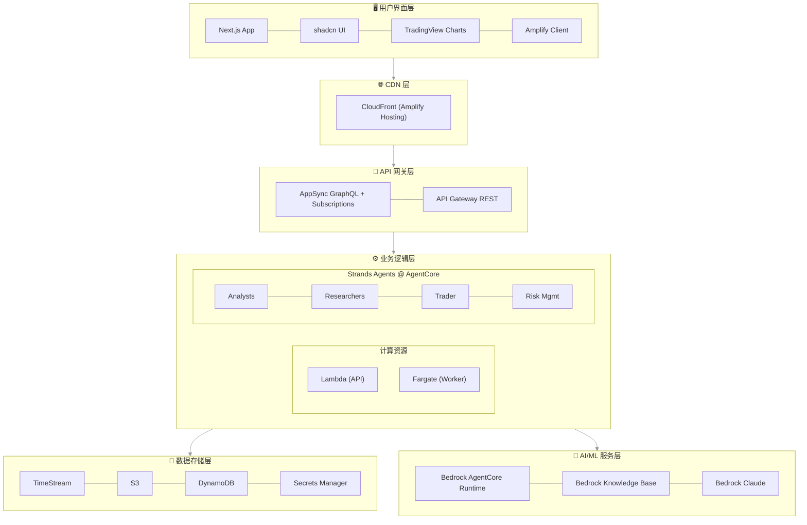
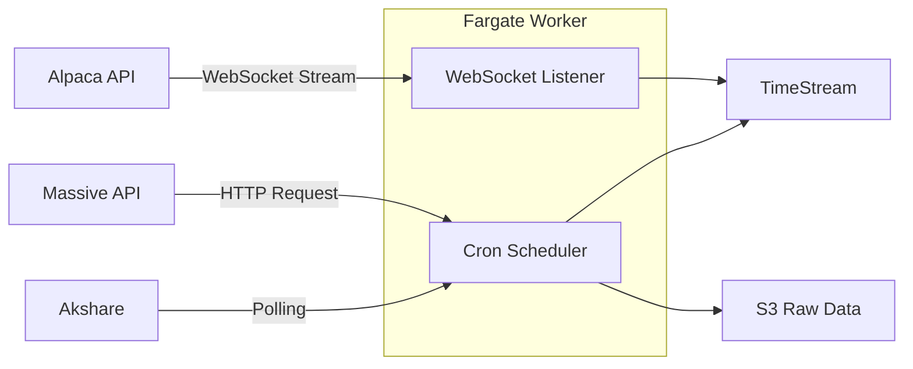
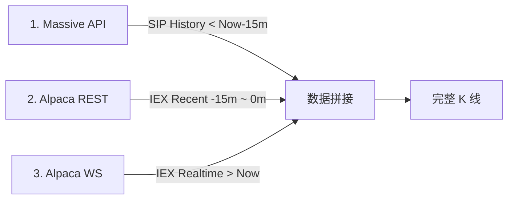
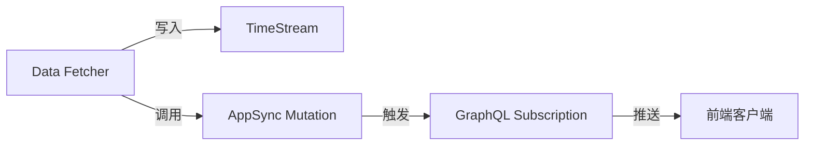
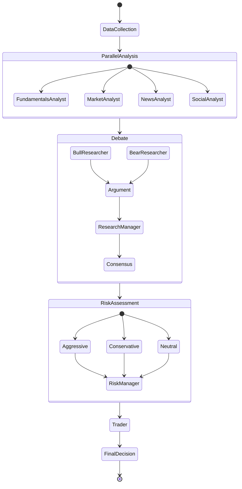

# WavePilotAI 系统设计文档

## 🏗️ 系统架构总览

### 架构原则
- **Serverless 优先**：充分利用 AWS 托管服务，减少运维负担
- **事件驱动**：基于事件触发的异步处理架构
- **统一部署**：使用 Amplify Gen 2 统一管理全栈基础设施
- **All TypeScript**：前端、后端、Agents 全栈使用 TypeScript
- **可观测性**：完整的日志、监控和追踪体系
- **成本优化**：按需计费，自动扩缩容

### 系统架构图



> 📌 所有基础设施通过 Amplify Gen 2 (基于 CDK) 统一管理，包括 AgentCore

## 🚀 Amplify Gen 2 统一架构

### 为什么选择 Amplify Gen 2？

**Amplify Gen 2 = CDK + 前端优化 + 自动 CI/CD**

- ✅ **统一部署**：一个命令部署所有资源（前端 + 后端 + AgentCore）
- ✅ **基于 CDK**：可以使用任何 AWS 服务，不受限制
- ✅ **自动 CI/CD**：Git push 自动触发构建和部署
- ✅ **深度集成**：前后端自动配置，无需手动管理 CORS、环境变量等
- ✅ **开发体验**：本地开发环境自动配置，热重载支持

### 项目结构

```
wavepilot/
├── apps/
│   ├── frontend/              # Next.js + Amplify Gen 2 (UI & API)
│   │   ├── amplify/           # AWS 资源定义 (Backend + AgentCore CDK)
│   │   │   ├── backend.ts     # 统一资源定义（含 AgentCore CDK）
│   │   │   ├── auth/
│   │   │   ├── data/
│   │   │   └── functions/
│   │   ├── app/               # Next.js App Router
│   │   └── package.json
│   │
│   ├── worker/                # TypeScript Fargate Worker (数据摄取)
│   │   ├── Dockerfile
│   │   ├── package.json
│   │   └── src/
│   │
│   └── agents/                # Strands Agents TypeScript
│       ├── package.json       # Node.js 项目配置
│       ├── tsconfig.json      # TypeScript 配置
│       ├── Dockerfile         # AgentCore 容器
│       ├── src/
│       │   ├── index.ts       # Express 服务器入口
│       │   ├── orchestrator.ts # 多 Agent 编排
│       │   ├── agents/        # Agent 定义
│       │   └── tools/         # Agent 工具
│
├── docs/                      # 项目文档
└── amplify.yml                # CI/CD 构建配置 (手动管理以支持 Monorepo)
```

### 资源定义方式

在 `amplify/backend.ts` 中使用 CDK 定义所有资源：

```typescript
import { defineBackend } from '@aws-amplify/backend';
import * as timestream from 'aws-cdk-lib/aws-timestream';
import * as s3 from 'aws-cdk-lib/aws-s3';
import * as agentcore from '@aws-cdk/aws-bedrock-agentcore-alpha';
import * as cdk from 'aws-cdk-lib';
import * as path from 'path';

const backend = defineBackend({
  auth,    // Cognito
  data,    // AppSync + DynamoDB
  dataFetcher,  // Lambda functions
});

// 获取 CDK stack，可以添加任何 AWS 资源
const dataStack = backend.createStack('DataResources');
const agentStack = backend.createStack('AgentResources');

// 创建 Timestream（完全的 CDK 代码）
const timestreamDb = new timestream.CfnDatabase(dataStack, 'Database', {
  databaseName: 'wavepilot-db',
});

// 从本地代码构建 Agent 容器镜像
// CDK 会自动构建 Docker 镜像并推送到 ECR
const agentArtifact = agentcore.AgentRuntimeArtifact.fromAsset(
  path.join(__dirname, '../../agents')  // 指向 agents 应用目录
);

// 创建 AgentCore Runtime
const agentRuntime = new agentcore.Runtime(agentStack, 'StockAnalyst', {
  runtimeName: 'wavepilot-stock-analyst',
  agentRuntimeArtifact: agentArtifact,
});

// 创建 Agent Memory
// Short-term Memory 自动启用（会话内上下文）
// Long-term Memory 通过 memoryStrategies 配置
const agentMemory = new agentcore.Memory(agentStack, 'AgentMemory', {
  memoryName: 'wavepilot-agent-memory',
  description: 'WavePilot AI agent memory for user preferences and analysis history',

  // Short-term Memory 过期时间（默认 90 天）
  expirationDuration: cdk.Duration.days(90),

  // Long-term Memory 策略配置
  memoryStrategies: [
    // 1. 用户偏好策略：自动学习风险偏好、关注股票等
    agentcore.MemoryStrategy.usingBuiltInUserPreferences(),

    // 2. 摘要策略：每 5 轮对话自动生成分析摘要
    agentcore.MemoryStrategy.usingBuiltInSummarization({
      summaryFrequency: 5,
    }),
  ],
});
```

## 📊 数据流设计

### 1. 数据获取流程 (Hybrid)



### 2. 数据获取与存储策略 (混合源成本优化策略)

> **背景**: Massive $29/mo 套餐有 15分钟延迟。为了实现实时无缝体验且不增加成本，我们采用 **Massive (历史 SIP) + Alpaca (实时 IEX)** 混合拼接方案。

#### 核心方案：三段式数据拼接 (Three-Stage Stitching)

为了填补 Massive 的 15 分钟延迟空缺，我们将数据流分为三段拼接：



#### A. 自选股 (Watchlist) - "自动回补与拼接"
*   **添加时 (Auto-Backfill)**: Fargate 执行 **三段式补全**：
    1.  **远端历史 (Stage 1)**: 调用 Massive `Aggregates` 获取 `1 Month Ago` ~ `Now - 15m` (SIP 数据，延迟但准确)。
    2.  **近端补缺 (Stage 2)**: 调用 Alpaca `Bars` API 获取 `Now - 15m` ~ `Now` (IEX 数据，实时填补空缺)。
    3.  **写入**: 将拼接后的数据写入 `stock_quotes_raw`。
*   **实时 (Stage 3)**: 监听 Alpaca WebSocket (IEX)，实时写入 `stock_quotes_raw`。
*   **修正 (Correction)**: 每日收盘后，调用 Massive SIP 数据修正当日历史。

#### B. 非自选股 - "延迟快照 + 实时透传"
*   **全市场快照**: Fargate 每 5 分钟调用 Massive `Snapshot` (注意：这是 15m 延迟的数据)。
    *   用途：主要用于热力图、涨幅榜等**非实时敏感**的宏观分析。
    *   **每日清理**: 盘后清空分钟级快照。
*   **详情页查看 (On-Demand)**:
    *   **历史**: 透传 Massive API (SIP, < -15m)。
    *   **近端**: 透传 Alpaca API (IEX, > -15m) 以获取最新走势。

#### C. 数据拼接逻辑 (Data Stitching)
为了实现无缝图表体验，API 层按以下逻辑返回数据：

1.  **分时/分钟图 (Intraday)**:
    *   `History` (< 今日 09:30): 读 `stock_quotes_raw` (自选) 或 透传 Massive API (非自选)。
    *   `Today` (09:30 ~ Now): 读 `stock_quotes_raw` + (非自选时) 实时 API 补全空隙。
2.  **日线/周线图 (Daily/Weekly)**:
    *   `History` (< 今日): 直接读 `stock_quotes_aggregated` (全市场日线已存)。
    *   `Today` (实时): 取 `stock_quotes_raw` 中最新一条数据拼接到最后。

### 2. 实时数据推送流程（AppSync Subscription）



**AppSync 优势**：
- **自动连接管理**：无需手动处理 WebSocket 连接
- **内置扩展性**：自动扩展，无连接数限制
- **离线支持**：客户端离线后自动缓存，上线后同步
- **简化开发**：无需管理连接状态

### 3. 技术指标计算策略 (On-Demand)

> **核心原则**：技术指标（MA, MACD, RSI 等）属于衍生数据，采用**按需即时计算**策略，**不进行持久化存储**。这能最大程度降低存储成本并提高分析灵活性。

#### 计算分层架构

| 场景 | 计算位置 | 负责组件 | 数据源 | 优势 |
| :--- | :--- | :--- | :--- | :--- |
| **前端图表展示** | 浏览器端 (Client) | `TradingView Lightweight Charts` | API 返回的 K 线数据 | 响应微秒级，通过 GPU 加速渲染，后端零压力 |
| **Agent 深度分析** | 内存中 (In-Memory) | `MarketAnalyst` Agent | 从 Timestream 读取的 Recent K 线 | 灵活计算任意参数（如 EMA-13 vs EMA-20），无 I/O 瓶颈 |

#### 工作流程示例 (Agent 分析)

1. **获取数据**：`MarketAnalyst` 请求最近 500 根 K 线 (`stock_quotes_raw`)。
2. **内存计算**：
   - 使用 `talib` 或 `technicalindicators` 库。
   - 动态计算所需指标（如 `calculateRSI(closePrices, 14)`）。
3. **执行分析**：基于计算结果判断趋势（如 "RSI > 80, 超买"）。
4. **释放内存**：分析报告生成后，指标数据随内存回收，**不写入数据库**。

### 4. Agent 分析流程



### Agent 角色说明

| 角色 | 职责 |
|------|------|
| **分析师团队** | 并行执行，各自专注一个领域 |
| FundamentalsAnalyst | 财务报表分析、估值计算（PE/PB/DCF） |
| MarketAnalyst | 技术指标、趋势识别、支撑阻力位 |
| NewsAnalyst | 新闻事件影响评估、宏观分析 |
| SocialAnalyst | 社交媒体情绪、市场热点 |
| **研究团队** | 顺序辩论，形成共识 |
| BullResearcher | 乐观视角，识别增长机会 |
| BearResearcher | 悲观视角，识别风险因素 |
| ResearchManager | 协调辩论、综合双方观点、形成研究共识 |
| **风险团队** | 多角度评估 |
| Aggressive/Conservative/Neutral | 三种风险偏好下的策略评估 |
| RiskManager | 综合风险评估、制定风险限额 |
| **执行** | 最终决策 |
| Trader | 综合所有分析，输出买入/持有/卖出建议、目标价位、置信度 |

## 🗄️ 数据库设计

### 1. Timestream 表设计

#### stock_quotes_raw（原始行情数据 - 1 分钟）

```sql
CREATE TABLE stock_quotes_raw (
    time TIMESTAMP,              -- 时间戳
    ticker VARCHAR,              -- 股票代码（AAPL, 000001.SZ, 600000.SH）
    name VARCHAR,                -- 股票名称
    market VARCHAR,              -- 市场（US, CN, HK）
    price DOUBLE,                -- 当前价格
    change DOUBLE,               -- 涨跌额
    changePercent DOUBLE,        -- 涨跌幅百分比
    volume BIGINT,               -- 成交量
    high DOUBLE,                 -- 最高价
    low DOUBLE,                  -- 最低价
    open DOUBLE,                 -- 开盘价
    previousClose DOUBLE         -- 前收盘价
)
WITH (
    MEMORY_STORE_RETENTION_PERIOD = '7d',
    MAGNETIC_STORE_RETENTION_PERIOD = '3650d'
)
```

#### stock_quotes_aggregated（聚合行情数据 - 日线）

> **用途**：仅存储每日 (1D) 的历史 K 线数据。
> **原因**：
> 1. **查询加速**：日线及以上周期（周/月）图表跨度通常为数年，直接查询 1D 数据远快于从 1m Raw 数据聚合。
> 2. **分工明确**：分时/5分钟/30分钟/1小时等分钟级周期由 `stock_quotes_raw` (1m) 实时聚合；日/周/月/年线由本表支持。
> 3. **数据一致性**：每日收盘后使用 Massive `Grouped Daily` 官方数据校准，确保历史日线准确无误。

```sql
CREATE TABLE stock_quotes_aggregated (
    time TIMESTAMP,              -- 时间戳（通常为当日 00:00:00 或收盘时间）
    ticker VARCHAR,              -- 股票代码
    name VARCHAR,                -- 股票名称
    market VARCHAR,              -- 市场（US, CN, HK）
    interval VARCHAR,            -- 时间间隔（固定为 '1d'）
    open DOUBLE,                 -- 开盘价
    high DOUBLE,                 -- 最高价
    low DOUBLE,                  -- 最低价
    close DOUBLE,                -- 收盘价
    change DOUBLE,               -- 涨跌额
    changePercent DOUBLE,        -- 涨跌幅百分比
    volume BIGINT,               -- 成交量
    trades INTEGER               -- 成交笔数
)
WITH (
    MEMORY_STORE_RETENTION_PERIOD = '28d', -- 近期日线在内存，加速访问
    MAGNETIC_STORE_RETENTION_PERIOD = '3650d' -- 保留 10 年历史
)
```


#### fundamentals（基本面数据）

> **用途**：存储股票的财务指标，支持按财报周期（TTM/季度/年度）查询和历史对比分析。

```sql
CREATE TABLE fundamentals (
    time TIMESTAMP,              -- 数据更新时间
    ticker VARCHAR,              -- 股票代码
    name VARCHAR,                -- 股票名称
    market VARCHAR,              -- 市场（US, CN, HK）
    
    -- 财报周期标识
    period_type VARCHAR,         -- 'TTM', 'Q1', 'Q2', 'Q3', 'Q4', 'FY'
    fiscal_year INTEGER,         -- 财年（2024, 2025...）
    fiscal_quarter INTEGER,      -- 季度（1-4），仅季报时有值
    report_date DATE,            -- 财报截止日期（如 2024-12-31）
    
    -- 估值指标
    pe_ttm DOUBLE,               -- 市盈率（TTM）
    pe_forward DOUBLE,           -- 远期市盈率（基于分析师预估）
    pb_ratio DOUBLE,             -- 市净率
    ps_ratio DOUBLE,             -- 市销率
    
    -- 盈利指标
    eps_ttm DOUBLE,              -- 每股收益（TTM）
    eps_diluted DOUBLE,          -- 稀释每股收益
    revenue DOUBLE,              -- 营业收入
    net_income DOUBLE,           -- 净利润
    
    -- 其他常用指标
    market_cap DOUBLE,           -- 市值
    roe DOUBLE,                  -- 净资产收益率
    dividend_yield DOUBLE        -- 股息率
)
WITH (
    MEMORY_STORE_RETENTION_PERIOD = '90d',
    MAGNETIC_STORE_RETENTION_PERIOD = '3650d' -- 保留 10 年财报历史
)
```

#### news（新闻事件 - 元数据）

```sql
CREATE TABLE news (
    time TIMESTAMP,
    ticker VARCHAR,              -- 股票代码
    name VARCHAR,                -- 股票名称
    market VARCHAR,              -- 市场
    source VARCHAR,
    title VARCHAR,
    url VARCHAR,
    sentiment DOUBLE,     -- 情感评分
    s3_key VARCHAR        -- 指向 S3 中完整内容的路径
)
WITH (
    MEMORY_STORE_RETENTION_PERIOD = '7d',
    MAGNETIC_STORE_RETENTION_PERIOD = '365d' -- 保留 1 年新闻历史
)
```

#### Watchlist（自选股 - Amplify Data Model）

通过 GraphQL Schema 定义，自动创建 DynamoDB 表：

```graphql
type Watchlist @model {
  userId: ID!
  ticker: String!
  name: String!
  market: String
  addedAt: AWSDateTime
  notes: String
  alerts: AWSJSON
}
```

#### simulation_trades（模拟交易）

```json
{
    "userId": "string",          // 分区键
    "tradeId": "string",        // 排序键
    "ticker": "string",
    "name": "string",            // 股票名称
    "market": "string",
    "action": "buy|sell",
    "quantity": "number",
    "price": "number",
    "timestamp": "timestamp",
    "portfolio": "string"
}
```

#### agent_analysis（分析结果）

```json
{
    "analysisId": "string",     // 分区键
    "timestamp": "timestamp",    // 排序键
    "ticker": "string",
    "name": "string",            // 股票名称
    "market": "string",
    "agentType": "string",
    "report": "string",
    "confidence": "number",
    "recommendation": "object"
}
```

### 3. S3 存储结构

单一 S3 存储桶，通过文件夹组织不同类型的数据：

```
s3://wavepilot-data-{account}/
├── raw/                        # 原始数据
│   ├── news/                   # 新闻完整正文 (JSON)
│   │   └── {symbol}/{date}/{id}.json
│   └── financials/             # 完整财报 (XBRL/PDF)
│
├── processed/                   # 处理后数据
│   └── knowledge-base/         # Bedrock Knowledge Base 数据源
```

**生命周期策略**
开发前期不添加 s3 生命周期策略，未来可添加如下策略：
- `raw/`: 90 天后转 IA，365 天后转 Glacier
- `knowledge-base/`: 180 天后转 IA，730 天后转 Deep Archive（永久保留）

## 🤖 Multi-Agent 系统设计

### 1. Strands Agents TypeScript 架构

使用 Strands Agents TypeScript SDK 的 **Graph Pattern** 实现复杂的分析流程：

```typescript
// apps/agents/src/agents/fundamentals-analyst.ts
import { z } from 'zod';
import * as strands from '@strands-agents/sdk';

// 定义工具
const getFinancialsTool = strands.tool({
  name: 'get_financials',
  description: 'Get financial data for a stock',
  inputSchema: z.object({
    ticker: z.string(),
    market: z.enum(['US', 'CN', 'HK']),
  }),
  callback: async (input) => {
    // 调用 Timestream 或外部 API
    return await fetchFinancials(input.ticker, input.market);
  },
});

// 配置 Agent
export const fundamentalsAnalyst = new strands.Agent({
  model: new strands.BedrockModel({
    region: 'us-west-2',
    modelId: 'anthropic.claude-sonnet-4-5-20241022-v2:0',
  }),
  tools: [getFinancialsTool, calculateRatiosTool],
  systemPrompt: `You are a fundamentals analyst...`,
});
```

### 2. Agent 服务入口 (Express)

```typescript
// apps/agents/src/index.ts
import express from 'express';
import { fundamentalsAnalyst } from './agents/fundamentals-analyst';
import { marketAnalyst } from './agents/market-analyst';

const PORT = process.env.PORT || 8080;
const app = express();

// AgentCore 健康检查 (必需)
app.get('/ping', (_, res) => res.json({ 
  status: 'Healthy',
  time_of_last_update: Math.floor(Date.now() / 1000),
}));

// Agent 调用 (必需)
app.post('/invocations', express.raw({ type: '*/*' }), async (req, res) => {
  const payload = JSON.parse(new TextDecoder().decode(req.body));
  const { agentType, prompt } = payload;
  
  const agent = agentType === 'fundamentals' 
    ? fundamentalsAnalyst 
    : marketAnalyst;
    
  const response = await agent.invoke(prompt);
  return res.json({ response });
});

app.listen(PORT, () => {
  console.log(`AgentCore Runtime server on port ${PORT}`);
});
```

### 3. Agent 部署（使用 CDK 集成到 Amplify）

在 `apps/frontend/amplify/backend.ts` 中添加 AgentCore 资源（CDK 自动构建 Docker）：

```typescript
import * as agentcore from '@aws-cdk/aws-bedrock-agentcore-alpha';
import * as path from 'path';

const agentStack = backend.createStack('AgentResources');

// 使用 fromAsset 自动构建 Docker 并推送到 ECR（无需手动操作）
const agentArtifact = agentcore.AgentRuntimeArtifact.fromAsset(
  path.join(__dirname, '../../agents')  // 指向 Dockerfile 所在目录
);

// AgentCore Runtime
const stockAnalystRuntime = new agentcore.Runtime(agentStack, 'StockAnalyst', {
  runtimeName: 'wavepilot-stock-analyst',
  agentRuntimeArtifact: agentArtifact,
  // ... 其他配置
});
```

## 🚀 部署架构

### CI/CD 流程 (amplify.yml)

> **说明**：Monorepo 结构下需要在根目录创建 `amplify.yml`，使用 `applications` 配置多应用构建路径。

```yaml
# amplify.yml (项目根目录)
version: 1
applications:
  - appRoot: apps/frontend
    backend:
      phases:
        build:
          commands:
            - npm ci --prefix ../..  # 安装根目录依赖
            - npm ci                  # 安装 frontend 依赖
            - npx ampx pipeline-deploy --branch $AWS_BRANCH --app-id $AWS_APP_ID
    frontend:
      phases:
        preBuild:
          commands:
            - npm ci
        build:
          commands:
            - npm run build
      artifacts:
        baseDirectory: .next
        files:
          - '**/*'
      cache:
        paths:
          - node_modules/**/*
          - .next/cache/**/*
```

### 环境管理

- **开发环境**：本地 `amplify sandbox` 自动同步
- **生产环境**：Git main 分支自动部署
- **测试环境**：Git feature 分支自动创建预览环境

## 📊 监控告警设计

### 1. CloudWatch 指标

- **业务指标**：API 调用量、分析请求数、活跃用户数
- **性能指标**：响应时间、错误率、并发数
- **成本指标**：Lambda 执行时间、API 调用次数

### 2. Amplify 监控

- **部署监控**：构建状态、部署历史、错误日志
- **应用监控**：页面加载时间、API 延迟、错误率
- **用户分析**：活跃用户、会话时长、功能使用率

## 📋 技术选型理由

### 为什么选择 Amplify Gen 2？

- **统一管理**：前后端资源一体化管理，避免配置分离
- **基于 CDK**：完整的 AWS 服务访问能力，不受限制
- **自动化 CI/CD**：内置 Git 集成，零配置部署
- **开发体验**：本地沙箱环境，实时同步变更
- **成本优化**：按需付费，自动扩缩容

### 为什么选择 TypeScript Agent（而不是 Python）？

- **统一语言**：前端、后端、Agents 全部 TypeScript，减少上下文切换
- **CDK 集成**：AgentCore CDK 可直接集成到 Amplify backend.ts
- **简化部署**：无需管理 Python 虚拟环境
- **类型安全**：TypeScript 静态类型检查

### 为什么选择 Timestream？

- 专为时序数据优化，查询性能优秀
- 自动数据分层，成本优化
- 内置时序函数，简化分析

### 为什么选择 Strands Agents + AgentCore？

- 与 Bedrock 深度集成
- 支持多种协作模式（Graph Pattern）
- 生产就绪，可观测性好
- CDK 原生支持，简化部署

### 为什么选择 AppSync？

- 自动管理 WebSocket 连接
- 内置 GraphQL Subscription
- 离线支持和数据同步
- 与 Amplify 深度集成

## 🎯 部署清单

```bash
# 1. 本地开发
cd apps/frontend
npm install && npx amplify init
npx amplify sandbox    # 启动沙箱环境
npm run dev            # 启动前端开发服务器

# 2. Agent 开发
cd apps/agents
npm install
npm run dev            # 本地测试 Agent

# 3. 配置 API 密钥（部署后在 AWS Secrets Manager 更新）
aws secretsmanager update-secret \
  --secret-id wavepilot/api-keys \
  --secret-string '{...}'

# 4. 生产部署（CDK 自动构建 Docker 并创建 AgentCore Runtime）
npx amplify push       # 一键部署所有资源
# 或配置 Git 自动部署
git push origin main
```

## 成本估算

**月度成本（预估）**：

- Amplify Hosting: ~$5-10
- Fargate (t4g.nano): ~$3-5
- Timestream: ~$15-25
- DynamoDB: ~$10-20
- S3: ~$5-10
- Lambda: ~$5-10
- AppSync: ~$5-10
- AgentCore Runtime: ~$10-30
- Massive Subscription: $29
- **总计**: ~$85-150/月

---

*本文档版本：1.0*
*更新日期：2025-12-08*
*作者：JN.L*
