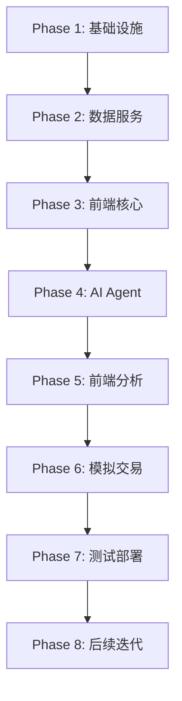

# WavePilotAI 开发任务清单

## 📋 任务管理说明

### 优先级定义
- 🔴 **P0**：核心功能，必须完成
- 🟡 **P1**：重要功能，应该完成
- 🟢 **P2**：增强功能，可以延后

### 任务状态
- ⬜ 未开始
- 🟦 进行中
- ✅ 已完成
- ⏸️ 暂停
- ❌ 取消

### 工作量评估
- **S**：小型任务（< 4 小时）
- **M**：中型任务（4-16 小时）
- **L**：大型任务（16-40 小时）
- **XL**：超大型任务（> 40 小时）

---

## 🚀 Phase 1: 基础设施搭建

### 1.1 项目初始化 🔴
- ✅ **[S]** 创建项目目录结构
- ✅ **[S]** 配置 TypeScript 环境（全栈统一）
- ✅ **[S]** 设置 ESLint、Prettier 代码规范
- ✅ **[S]** 初始化 Git 仓库和 .gitignore
- ✅ **[S]** 创建 README 文档

### 1.2 AWS 基础设施 (Amplify Gen 2) 🔴
- ✅ **[M]** 创建 Amplify Gen 2 项目结构（统一架构）
- ✅ **[M]** 在 amplify/backend.ts 中定义所有资源
- ✅ **[L]** 实现基础设施资源：
  - ✅ Timestream for InfluxDB（Candles, Fundamentals, News）
  - ✅ S3 存储桶（raw, processed, knowledge-base）
  - ✅ DynamoDB 表（watchlist, trades, analysis）
  - ✅ Secrets Manager（API 密钥）
  - ✅ CloudWatch 日志组
- ✅ **[S]** 配置环境变量管理（通过 Amplify）
- ⬜ **[S]** 部署 Amplify 应用（需要有权限的 AWS 账号）

### 1.3 认证系统 (Amplify Auth) 🔴
- ✅ **[M]** 配置 Cognito 用户池（通过 Amplify Auth）
- ⬜ **[M]** 实现用户注册/登录流程
- ✅ **[S]** 配置 JWT 令牌验证（Amplify 自动处理）
- ✅ **[S]** 实现密码重置功能（Amplify Auth 内置）

---

## 📊 Phase 2: 数据服务层

### 2.1 数据摄取 Worker (Fargate - TypeScript) 🔴
- ✅ **[M]** 创建 apps/worker TypeScript 项目
  - ✅ package.json, tsconfig.json, Dockerfile 配置
  - ✅ src/index.ts 入口（含健康检查服务器、优雅关闭）
  - ✅ src/services/ 目录结构
- ✅ **[L]** 实现 Alpaca WebSocket 监听
  - ✅ alpaca-websocket.ts 完整实现
  - ✅ 实时获取美股行情（IEX feed）
  - ✅ 写入 InfluxDB (1m bar)
  - ✅ 自动重连机制
  - ✅ 动态订阅/取消订阅
  - ✅ REST API 回补近端数据（15 分钟）
  - ✅ 市场状态感知（仅开盘时连接）
- ✅ **[L]** 实现 Massive WebSocket 监听
  - ✅ massive-websocket.ts 完整实现
  - ✅ 实时获取 SIP 数据（15 分钟延迟）
  - ✅ 自动覆盖 IEX 数据（同 timestamp）
  - ✅ 收盘后 15 分钟断开（确保当天数据完整修正）
- ✅ **[M]** 实现 Massive API 集成
  - ✅ massive-scheduler.ts 完整实现
  - ✅ **[Snapshot]** 全市场快照 (`getSnapshots` -> `stock_quotes_aggregated`)
  - ✅ **[EOD]** 全市场日线修正 (`Grouped Daily` -> `stock_quotes_aggregated`)
  - ✅ **[EOD]** 自选股分钟数据修正 (`Aggregates` -> `stock_quotes_raw`)
  - ✅ **[Scheduled]** 新闻定时获取 (15m)
  - ✅ **[Scheduled]** 财务数据定时更新 (Daily)
  - ✅ 手动任务触发接口
  - ✅ 历史数据回补接口
- ✅ **[M]** 实现新闻服务
  - ✅ news-service.ts 完整实现（S3 + InfluxDB 写入）
  - ✅ 集成到 MassiveScheduler 定时任务
- ✅ **[S]** 实现市场状态工具
  - ✅ market-status.ts（Massive API + 时间回退）
  - ✅ 1 分钟缓存避免重复调用
- ⬜ **[M]** 实现 Akshare 轮询（A 股实时行情 - Phase 8）
- ⬜ **[M]** 在 Amplify 中定义 Fargate 资源

### 2.2 AppSync API 层 🔴
- ⬜ **[M]** 创建 AppSync GraphQL API
- ⬜ **[M]** 定义 GraphQL Schema
  - ⬜ Query（getStock, getWatchlist）
  - ⬜ Mutation（updateStockPrice, addToWatchlist, removeFromWatchlist）
  - ⬜ Subscription（onUpdateStockPrice）
- ⬜ **[M]** 实现 AppSync Resolver Lambda
- ⬜ **[M]** 配置 Cognito 授权器

### 2.3 REST API 🟡
- ⬜ **[M]** 创建 REST API（非实时接口）
  - ⬜ GET /market/snapshot?market=US - 全市场最新股价快照
  - ⬜ GET /analysis/{analysisId} - 获取分析结果
- ⬜ **[S]** 实现 API 认证和限流

---

## 🎨 Phase 3: 前端开发（核心功能）

### 3.1 前端基础架构 🔴
- ✅ **[M]** 创建 Next.js 项目（App Router）
- ✅ **[M]** 初始化 Amplify Gen 2
- ⬜ **[M]** 配置 shadcn/ui 组件库
- ⬜ **[S]** 设置 Tailwind CSS
- ⬜ **[M]** 实现基础布局组件
- ⬜ **[S]** 配置路由结构

### 3.2 AppSync 集成 🔴
- ⬜ **[M]** 配置 Apollo Client
- ⬜ **[M]** 实现 GraphQL Queries / Mutations
- ⬜ **[M]** 实现 GraphQL Subscriptions（实时价格更新）

### 3.3 认证界面 🔴
- ⬜ **[M]** 实现登录/注册页面
- ⬜ **[S]** 实现密码重置页面
- ⬜ **[M]** 集成 Cognito 认证

### 3.4 K 线图与分时图 🔴
- ⬜ **[L]** 集成 TradingView Lightweight Charts
- ⬜ **[M]** 实现 K 线图组件
  - ⬜ 多周期支持（1m, 5m, 1h, 1d, 1w, 1M）
  - ⬜ 技术指标叠加（MA）
- ⬜ **[M]** 实现分时图组件
- ⬜ **[M]** 实现技术指标副图（成交量、MACD、RSI）
- ⬜ **[S]** 实现图表交互功能

### 3.5 自选股管理 🔴
- ⬜ **[M]** 实现自选股页面
  - ⬜ 股票搜索
  - ⬜ 自选股列表
  - ⬜ 添加/删除自选股
  - ⬜ 实时价格更新（AppSync Subscription）

---

## 🤖 Phase 4: AI Agent 系统

### 4.1 Strands Agents TypeScript 基础 🔴
- ✅ **[M]** 初始化 TypeScript 项目（package.json, tsconfig.json）
- ✅ **[M]** 安装 Agent 相关依赖（@strands-agents/sdk, express, zod）
- ✅ **[L]** 实现 Graph Pattern 框架
  - ✅ 创建 orchestrator.ts（编排器入口）
  - ✅ 实现并行分析阶段（runParallelAnalysis）
  - ✅ 实现辩论阶段（runDebate）
  - ✅ 实现风险评估阶段（runRiskAssessment）
  - ✅ 实现最终决策阶段（runTradingDecision）
- ⬜ **[M]** 配置 Bedrock 模型访问（IAM 权限）

### 4.2 分析师 Agents 🔴
- 🟦 **[L]** 实现 FundamentalsAnalyst（✅ 结构已创建）
- 🟦 **[L]** 实现 MarketAnalyst（✅ 结构已创建）
- 🟦 **[L]** 实现 NewsAnalyst（✅ 结构已创建）
- 🟦 **[M]** 实现 SocialMediaAnalyst（✅ 结构已创建）

### 4.3 研究员和决策 Agents 🔴
- ✅ **[M]** 实现 BullResearcher - 结构已创建
- ✅ **[M]** 实现 BearResearcher - 结构已创建
- ✅ **[M]** 实现 ResearchManager - 结构已创建
- ⬜ **[M]** 实现辩论机制
- ⬜ **[M]** 实现风险评估 Agents
- ✅ **[M]** 实现 RiskManager - 结构已创建
- ✅ **[L]** 实现 Trader - 结构已创建

### 4.4 Agent 工具集成 🔴
- 🟦 **[M]** 封装数据获取工具
  - 🟦 tools/timestream.ts（文件已创建，实现为 TODO）
  - 🟦 tools/indicators.ts（文件已创建，实现为 TODO）
- ⬜ **[S]** 配置工具权限（IAM）
- ⬜ **[S]** 实现工具调用日志

### 4.5 Agent 部署 (CDK + AgentCore) 🔴
- ✅ **[M]** 创建 Express 服务器入口 (index.ts)
  - ✅ /ping 健康检查端点
  - ✅ /invocations 调用端点
- ✅ **[M]** 创建 Dockerfile
- ⬜ **[M]** 在 backend.ts 添加 AgentCore CDK
- ⬜ **[S]** 测试 Agent 协作流程

---

## 📈 Phase 5: 前端开发（股票分析）

### 5.1 股票详情页 🔴
- ⬜ **[L]** 实现股票详情页
  - ⬜ K 线图 + 技术指标
  - ⬜ 实时价格更新
  - ⬜ 基本面数据展示

### 5.2 AI 分析页面 🔴
- ⬜ **[L]** 实现分析触发界面
  - ⬜ 选择分析深度（快速/标准/深度）
- ⬜ **[M]** 实现流式结果展示
- ⬜ **[M]** 实现历史分析记录

---

## 💼 Phase 6: 模拟交易系统

### 6.1 交易引擎 🟡
- ⬜ **[L]** 实现交易执行 Lambda
  - ⬜ 买入/卖出逻辑
  - ⬜ 资金验证
  - ⬜ 持仓管理
- ⬜ **[M]** 实现收益计算逻辑
- ⬜ **[M]** 实现交易历史记录（DynamoDB）

### 6.2 模拟盘界面 🟡
- ⬜ **[L]** 实现交易界面
  - ⬜ 下单组件
  - ⬜ 持仓展示
  - ⬜ 资金状态
- ⬜ **[M]** 实现交易历史页面
- ⬜ **[M]** 实现收益曲线图表

---

## 🔧 Phase 7: 测试、优化与部署

### 7.1 测试 🔴
- ⬜ **[M]** 编写单元测试
- ⬜ **[M]** 编写集成测试
- ⬜ **[S]** 性能测试
- ⬜ **[S]** 安全测试

### 7.2 优化 🟡
- ⬜ **[M]** 前端性能优化
- ⬜ **[M]** 后端性能优化
- ⬜ **[M]** 成本优化分析

### 7.3 部署 
- ⬜ **[M]** 配置部署环境
- ⬜ **[M]** 部署 Amplify 应用
- ⬜ **[S]** 验证 AgentCore Runtime 部署

### 7.4 监控 🟡
- ⬜ **[M]** 配置 CloudWatch 监控
- ⬜ **[S]** 设置告警规则

---

## 📈 Phase 8: 后续迭代 🟢

### 8.1 A 股市场支持
- ⬜ **[L]** 集成 AKShare A 股 API
- ⬜ **[M]** 适配 A 股交易时间
- ⬜ **[M]** 添加 A 股特有指标

### 8.2 高级功能
- ⬜ **[L]** 实现交易策略回测
- ⬜ **[L]** 添加更多技术指标
- ⬜ **[M]** 实现价格提醒功能
- ⬜ **[M]** 添加导出功能

### 8.3 缠论特征分析 (Chanlun Features) 🟢
- ⬜ **[L]** 实现 K 线包含关系处理 (Inclusion Handling)
- ⬜ **[L]** 实现分型与笔识别 (Fractals & Strokes)
- ⬜ **[L]** 实现中枢区间计算 (Center Range)
- ⬜ **[M]** 实现 MACD 面积与背驰因子 (Divergence Factor)
- ⬜ **[L]** 实现买卖点识别与趋势判断
- ⬜ **[M]** 集成到 MarketAnalyst Agent

### 8.4 多用户支持
- ⬜ **[L]** 实现用户数据隔离
- ⬜ **[M]** 实现权限管理

---

## 🔄 任务依赖关系

---

## 💡 关键里程碑

1. **Phase 1 完成**：基础设施就绪，可开始数据接入
2. **Phase 2 完成**：数据服务可用，API 层就绪
3. **Phase 3 完成**：前端核心功能可用（K 线、分时、自选股）
4. **Phase 4 完成**：AI Agent 系统就绪
5. **Phase 5 完成**：股票分析功能可用
6. **Phase 6 完成**：模拟交易功能完成
7. **Phase 7 完成**：系统上线

---

---

*本文档版本：1.0*
*更新日期：2025-12-23*
*作者：JN.L*
